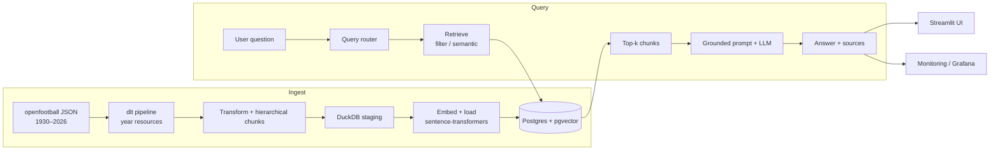
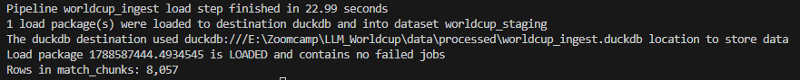
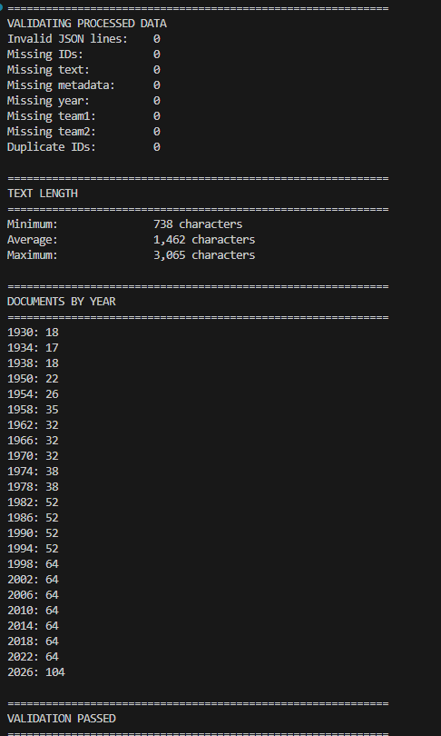
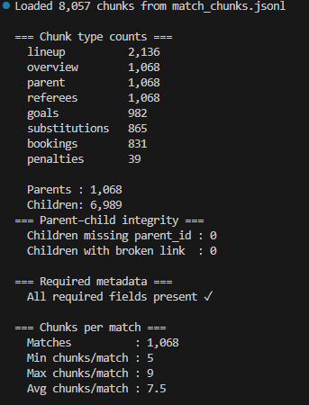
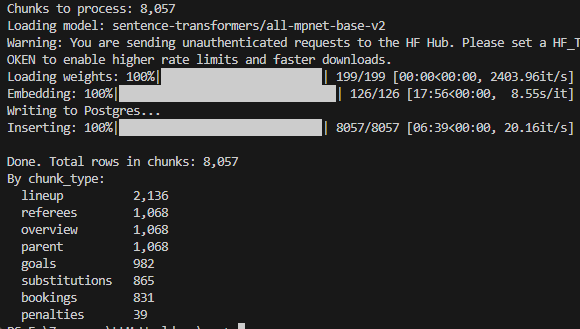
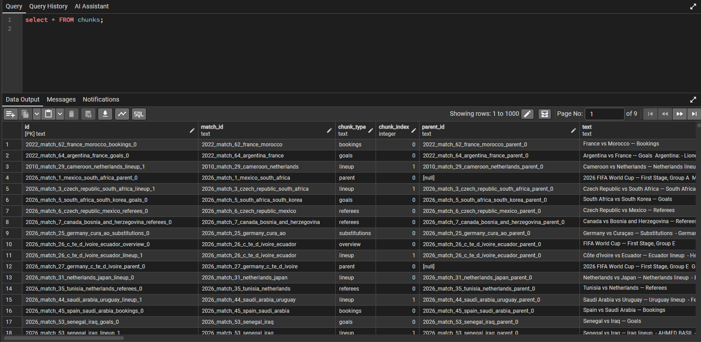
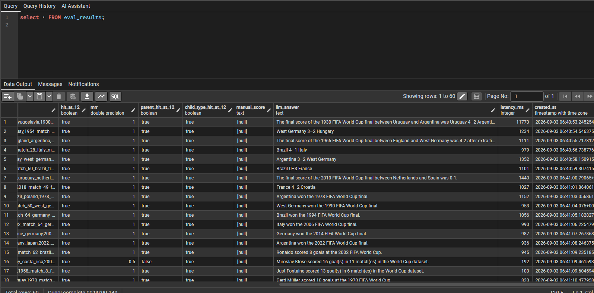
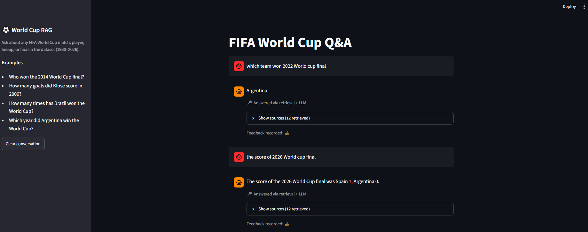
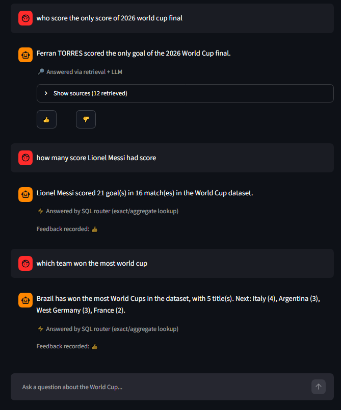
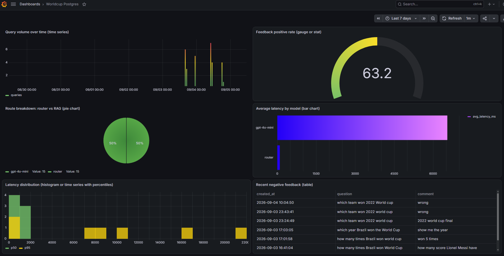

# LLM World Cup — RAG over FIFA World Cup History (1930–2026)

A retrieval-augmented generation (RAG) system that answers questions about historical FIFA World Cups using structured match data, semantic search over pgvector, and a grounded LLM response.


---

## Problem

Plain LLMs often hallucinate scores, scorers, and tournament details, especially for older World Cups or edge cases (e.g. 1950 format, incomplete future 2026 data). Generic web search is noisy and hard to ground.

This project builds a **domain-specific knowledge base** from open World Cup match data and a retrieval + generation pipeline that prefers evidence from that base. Answers stay grounded; when context is insufficient the system refuses rather than inventing facts.

---

## Project highlights

- **Incremental dlt pipeline** — World Cups are ingested year-by-year with [dlt](https://dlthub.com/). Re-runs can process only new or changed tournaments instead of a full reload.
- **Structured hierarchical chunking** — Each match is modeled as a parent document with typed child chunks (overview, goals, lineups, etc.). Retrieval can prefer the right chunk type while still using semantic similarity.
- **Query router** — Intent, year, and “final” signals steer retrieval between hard-filtered and pure semantic strategies. Both approaches are evaluated on a fixed 30-question set.
- **End-to-end, containerized stack** — One `docker compose` brings up Postgres/pgvector, the Streamlit app, Grafana, pgAdmin, and a one-shot ingest service (via profile).

---

## Architecture



**Data flow (ingest)**  
Raw JSON → dlt resources (per year) → transform & structured chunks → local DuckDB staging → embedding (`all-mpnet-base-v2`) → upsert into Postgres with metadata (year, `is_final`, chunk type, match id).

**Query flow**  
Question → router (year / final / intent) → retrieval (hard filter + boosts **or** pure semantic) → top-k contexts → grounded system prompt → LLM answer. The prompt is instructed to answer only from context and to refuse incomplete aggregates or future incomplete data.

---

## Data source

Match data comes from the open public-domain dataset:

**[openfootball/worldcup.json](https://github.com/openfootball/worldcup.json)**  
*Free open public domain football data for the World Cups (national teams) in JSON — including Canada/USA/Mexico 2026, Qatar 2022, Russia 2018, and earlier tournaments. No API key required.*

Years covered in this project: **1930–2026**.

---

## Tech stack


Optional dependency groups in `pyproject.toml`: `ingest`, `app`, `dev`.

---

## Quick start

### Prerequisites

- Docker + Docker Compose
- OpenAI API key
- Hugging Face token (for model download if needed)

### 1. Clone and configure

```bash
git clone https://github.com/Khangtran94/LLM_Worldcup_project.git
cd LLM_Worldcup_project

cp .env.example .env   # or create .env manually
```

Set in `.env`:

```env
OPENAI_API_KEY=sk-...
HF_TOKEN=hf_...
```

### 2. Start core services

```bash
docker compose up -d
```

This starts:

| Service   | URL / port        | Notes                    |
|-----------|-------------------|--------------------------|
| Postgres  | `localhost:5432`  | user/db/password: `worldcup` |
| Streamlit | http://localhost:8501 | Main RAG UI           |
| Grafana   | http://localhost:3000 | admin / admin          |
| pgAdmin   | http://localhost:5051 | admin@example.com / admin |

### 3. Run ingestion (one-shot)

```bash
docker compose --profile ingest run --rm ingest
```

This runs the dlt pipeline (download → transform → chunk → DuckDB) and the embed + load step into Postgres. Use the same command again when you add or update years; dlt is set up for year-level incrementality.

### 4. Ask questions

Open **http://localhost:8501** and query the World Cup knowledge base.

---

## Evaluation

### Offline retrieval evaluation

A fixed **30-question** test set lives in `data/eval/questions.csv`, with ideal `match_ids` and expected `chunk_types` for relevance judgments.

We evaluate **four offline metrics**:

| Metric | What it measures |
|--------|------------------|
| **Hit@12** | At least one relevant chunk appears in the top-12 retrieved results |
| **MRR** | Mean Reciprocal Rank of the first relevant result |
| **Parent Hit@12** | Relevant *parent* (match-level) document is present in the top-12 |
| **Child Type Hit@12** | A chunk of the expected *type* (overview, goals, lineup, …) is present in the top-12 |

**Retrieval comparison**

- **Approach A** — hard filter / metadata-aware (year, final, chunk-type preferences)  
- **Approach B** — pure semantic search  

Results are stored so runs are comparable (e.g. `eval_results` / retrieval eval tables). The stronger approach is used in the main application path.

Scripts:

- `src/load_eval_questions.py` — load the question set  
- `src/run_eval.py` — run retrieval evaluation and write metrics  

LLM-side multi-prompt / multi-model comparison is deferred; the current path uses a single grounded prompt tuned for factual World Cup questions.

---

## Monitoring (production)

Production traffic is logged separately from the offline eval harness so real usage never pollutes eval history.

### What we track

| Table | Fields | Purpose |
|-------|--------|---------|
| **`queries`** | `question`, `rewritten_question`, `retrieved_ids`, `response`, `model`, `latency_ms`, `created_at` | Every answered question from the app / CLI |
| **`feedback`** | `query_id`, `is_positive`, `comment`, `created_at` | Thumbs up/down (and optional comment) attached to a logged query |

Helpers: `src/monitoring.py` (`log_query`, `log_feedback`) and `src/monitoring_report.py` (CLI summary over production tables).

### Grafana dashboard

Dashboard **Worldcup Postgres** (http://localhost:3000, provisioned under `grafana/`) currently includes **six panels**:

1. **Query volume over time** — traffic trend  
2. **Feedback positive rate** — thumbs-up share  
3. **Route breakdown: router vs RAG** — how often the router answers directly vs full retrieval  
4. **Average latency by model** — latency per model / route  
5. **Latency distribution** — spread / percentiles  
6. **Recent negative feedback** — latest thumbs-down rows for debugging  

Datasource is the same Postgres instance used by the app.

---

## Screenshots

Images live under [`screenshots/`](screenshots/). Add the files below after you capture them; captions are ready.

### Ingestion & data quality



*dlt year-level ingest — pipeline load info and `match_chunks` row count*



*Processed-data validation — document counts, required fields, text-length stats, documents by year*



*Chunk statistics — chunk counts, parent–child integrity, required metadata, and chunks per match*



*Embed + load into Postgres — progress and final chunk count*

### Knowledge base & evaluation (pgAdmin)



*Knowledge base — `chunks` table with metadata (year, chunk_type, match_id, text)*



*Offline evaluation — `eval_results` (Hit@12, MRR, Parent Hit@12, Child Type Hit@12) for retrieval approaches*

### Streamlit UI



*Streamlit — question, grounded answer, and retrieved sources*



*Streamlit — user feedback (thumbs up/down) on an answer*

### Grafana monitoring



*Grafana **Worldcup Postgres** — query volume, feedback rate, route breakdown, latency, and recent negatives*

---

## Project structure

```text
.
├── docker-compose.yml          # postgres, app, ingest (profile), grafana, pgadmin
├── Dockerfile.app              # Streamlit service
├── Dockerfile.ingest           # one-shot dlt + embed/load
├── pyproject.toml / uv.lock
├── screenshots/                # UI, pipeline, DB, and monitoring captures
├── data/
│   ├── raw/                    # openfootball JSON by year
│   ├── processed/              # chunks, staging DuckDB
│   └── eval/questions.csv      # 30-question evaluation set
├── grafana/                    # provisioning + dashboards
└── src/
    ├── ingestion/              # dlt pipeline + resources
    ├── db/                     # schema, connection, eval migration
    ├── transform.py / chunk_matches.py / embed_and_load.py
    ├── retrieve.py / query_router.py / rag.py / prompt.py
    ├── streamlit_app.py / main.py
    ├── run_eval.py / load_eval_questions.py
    └── monitoring.py / monitoring_report.py
```

---

## Local development (optional)

With [uv](https://docs.astral.sh/uv/):

```bash
uv sync --extra ingest --extra app --extra dev

# Run dlt pipeline only
uv run python src/ingestion/pipeline.py

# Embed + load into a running Postgres
uv run python src/embed_and_load.py

# CLI RAG smoke test
uv run python src/main.py "Who won the 1998 World Cup?"

# Streamlit
uv run streamlit run src/streamlit_app.py
```

---

## Acknowledgments

- Match data: [openfootball/worldcup.json](https://github.com/openfootball/worldcup.json)  
- Vector search: [pgvector](https://github.com/pgvector/pgvector)  
- Ingestion: [dlt](https://dlthub.com/)  
